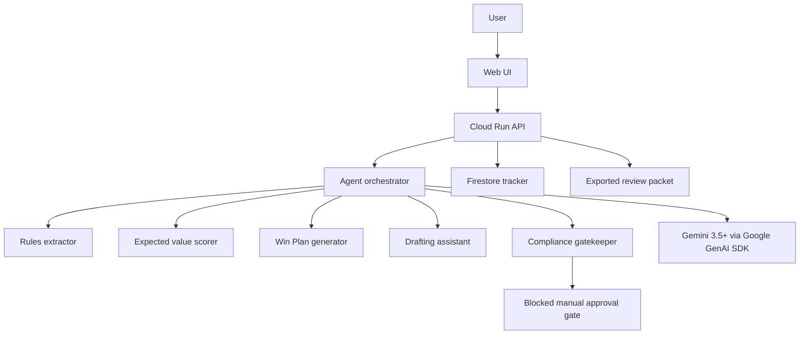

# PrizePilot Architecture

PrizePilot uses a simple production-minded split:

- Frontend: Vite + React dashboard.
- Backend: FastAPI service deployable to Cloud Run.
- Agent framework: Google GenAI SDK through `google-genai`.
- Model: `gemini-3.5-flash` by default, configurable with `GEMINI_MODEL`.
- Database: Firestore in cloud mode, local JSON fixtures in demo mode.
- Tests: pytest for scoring, compliance, status transitions, and win-plan generation.

The backend keeps the safety boundary server-side. The frontend can ask for drafts or plans, but compliance scanning remains a first-class backend module. The app intentionally has no endpoint that submits contests, accepts terms, pays fees, uploads tax documents, or creates accounts.

