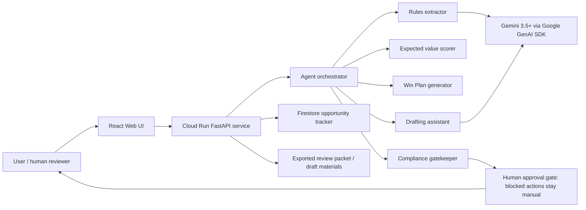

# PrizePilot Architecture Diagram

PrizePilot is a web workflow agent. The browser calls the Cloud Run API, which coordinates specialized modules for intake, rules extraction, scoring, planning, drafting, and compliance review. Gemini 3.5+ is accessed through the Google GenAI SDK when `GEMINI_API_KEY` is configured. Firestore is the production tracker, while local JSON fixtures are used for demos and tests.

